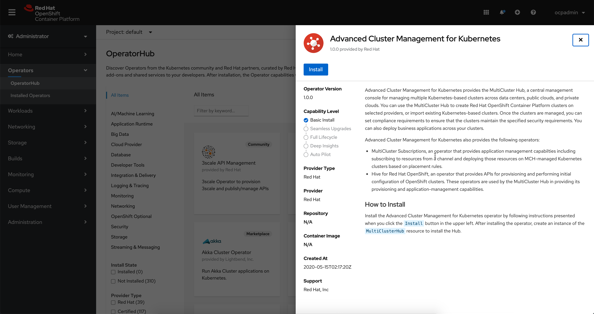
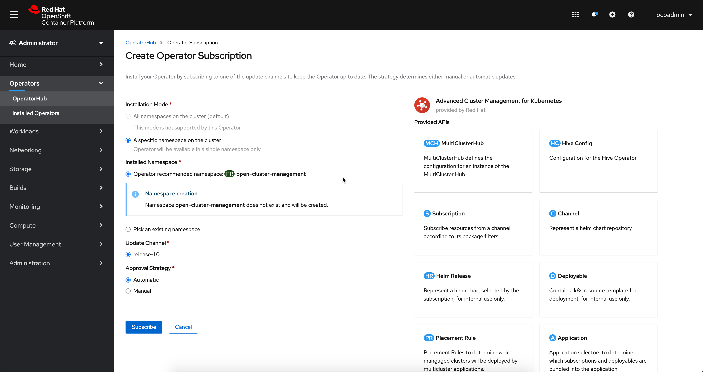
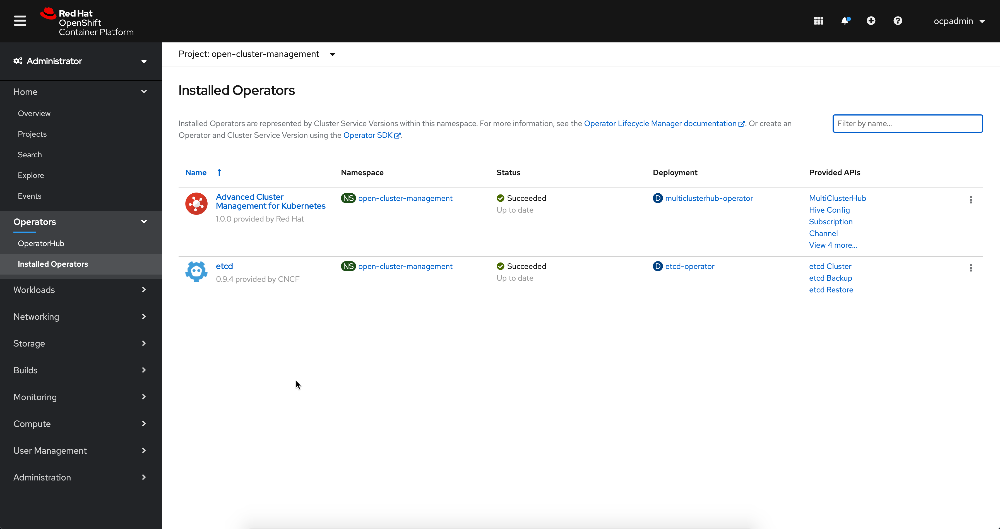
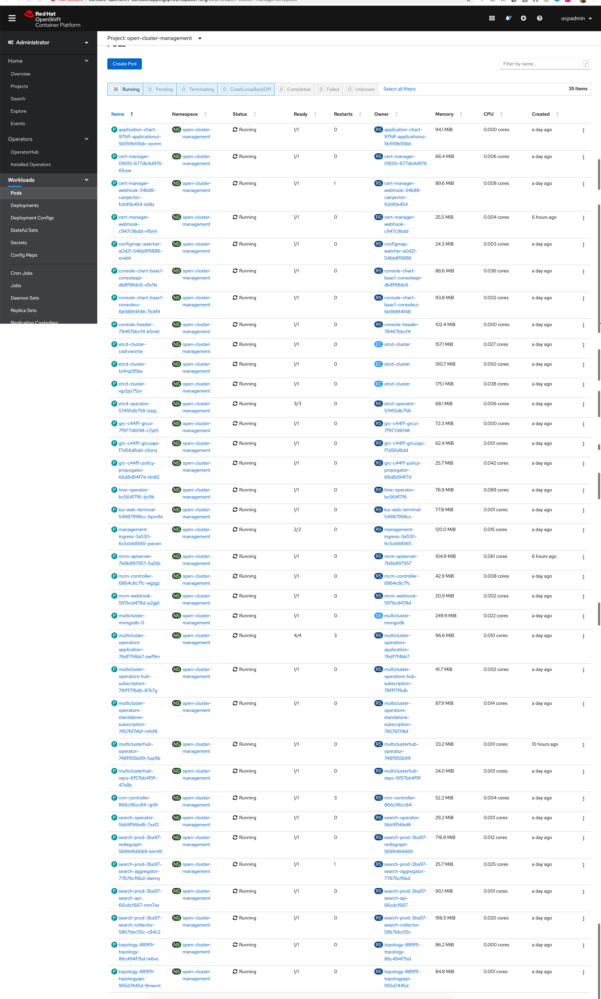
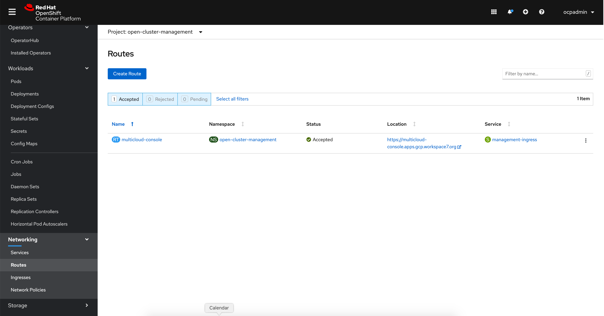
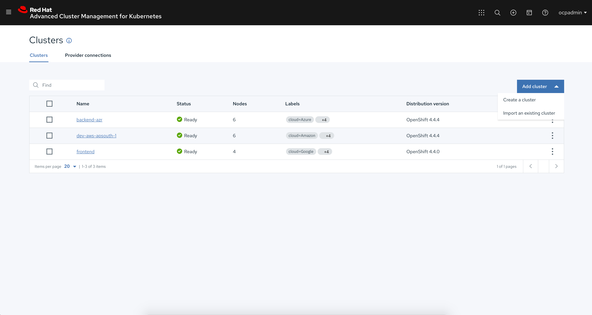

= Demos ACM Manifests

This repository holds all the RedHat Developer demos, https://www.redhat.com/en/technologies/management/advanced-cluster-management[Advanced Cluster Management for Kubernetes(ACM)]  manifests.

== Deploying ACM

The ACM can be deployed on any OpenShift cluster using the OperatorHub console,

In the setup the ACM will be deployed on to namespace called `open-cluster-management`

1.Select the ACM Operator from the Hub and click *Install* to start install,

2.Select all default options for install and click *Subscribe*

3.Wait for few minutes for the subscription install to complete. A successful install will be as shown the following screenshot:

=== Create Multicluster Hub

[IMPORTANT]
====
Login to the OpenShift using `oc` CLI as OpenShift cluster-admin.
====

[source,bash]
----
oc apply -n open-cluster-management \
  -- multiclusterhub.yaml
----

Wait for all the Multi Cluster Hub pods to be up and running. There will be a total of 35 pods tha need to be running. The followig screen shot shows a successful MultiCluster Hub deployment

Navigate to Multi Cluster Hub console using the URL as shown in the below screen shot:

Add new or import existing OpenShift clusters into the hub using the Multi Cluster Hub console:

== Manifests folders

link:./hybrid-demo[Hybrid Demo]

