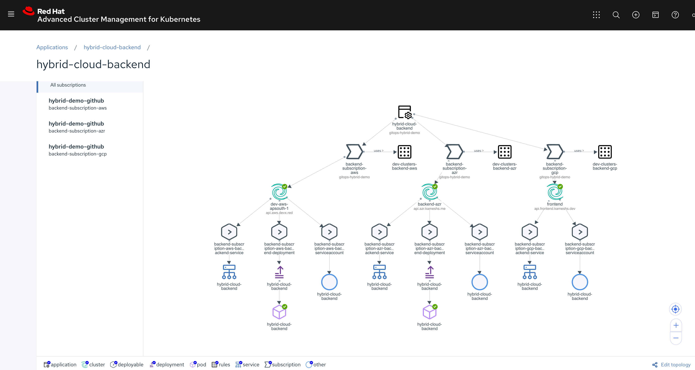
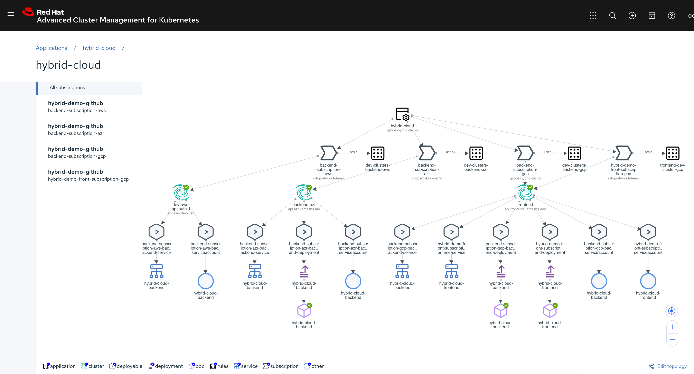

= Hybrid Cloud Demo

This repository holds the ACM manifests for deploying https://github.com/redhat-developer-demos[hybrid-cloud] demo.

== Pre-requsite

Ensure all the backed spoke clusters are set with the following labels:

- environment=dev
- tier=backend

You can edit and set labels via the GUI or use the following commands:

[source,bash]
----
oc label cluster -n <namespace of your cluster> <name of your cluster> environment=dev
oc label cluster -n <namespace of your cluster> <name of your cluster> tier=backend
----

For an example if we need to set the label on a cluster named `gcp-backend` which is in `my-gcp` namespace:

[source,bash]
----
oc label -n my-gcp cluster backend-gcp environment=dev
oc label -n my-gcp cluster backend-gcp tier=backend
----

[TIP]
====

* The `cluster` kind belong to api-group *clusterregistry.k8s.io*

* You can find all your clusters using the command 
[source,bash]
----
oc get clusters --all-namespaces
----
====

== Create Demo Namespace, GitHub Channel and hybrid-cloud Application

[IMPORTANT]
====
All the manifests in this demo should be applied on the ACM Hub cluster 
====

[source,bash]
----
cd $PROJECT_HOME/hybrid-demo
oc apply -k $PWD
----

== Deploying Backend

[source,bash]
----
cd $PROJECT_HOME/backend
----
Create the subscriptions and placement rules for the clusters managed by ACM:

==== Amazon

[source,bash]
----
oc apply --kustomize overlays/aws
----

==== Azure

[source,bash]
----
oc apply --kustomize overlays/azr
----

==== Google

[source,bash]
----
oc apply --kustomize overlays/gcp
----

NOTE: It will take few minutes for the deployments to be propogated to the clusters.

A successfull deployment will be as shown in the screenshot below:

== Deploying Frontend

[source,bash]
----
cd $PROJECT_HOME/frontend
----

Create the subscriptions and placement rules for the clusters managed by ACM and where the frontend application need to be deployed.

==== Amazon

[source,bash]
----
oc apply --kustomize overlays/aws
----

==== Azure

[source,bash]
----
oc apply --kustomize overlays/azr
----

==== Google

[source,bash]
----
oc apply --kustomize overlays/gcp
----

As with backend deployment it will take some time for the changes to be propogated to the cluster.
With a successfull deployment your application view should look like:

== Clean up 

To clean up the deployments, run :

=== Backend

[source,bash]
----
cd $PROJECT_HOME/hybrid-demo/backend
oc delete --kustomize overlays/aws
oc delete --kustomize overlays/azr
oc delete --kustomize overlays/gcp
----

=== Frontend

[source,bash]
----
cd $PROJECT_HOME/hybrid-demo/frontend
oc delete --kustomize overlays/aws
oc delete --kustomize overlays/azr
oc delete --kustomize overlays/gcp
----

=== Application, Channel and Namespace

[source,bash]
----
cd $PROJECT_HOME/hybrid-demo
oc delete --kustomize $PWD
----
